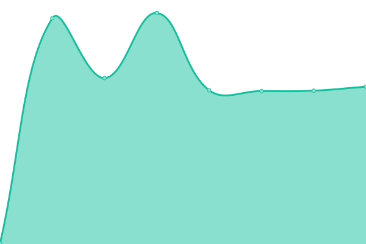

# [📈 Live Status](https://status.blinksma.eu): <!--live status--> **🟩 All systems operational**

This repository contains the open-source uptime monitor and status page for [Blinksma](https://status.blinksma.eu), powered by [Upptime](https://github.com/upptime/upptime).

With [Upptime](https://upptime.js.org), you can get your own unlimited and free uptime monitor and status page, powered entirely by a GitHub repository. We use [Issues](https://github.com/Blinksma/upptime-blinksma/issues) as incident reports, [Actions](https://github.com/Blinksma/upptime-blinksma/actions) as uptime monitors, and [Pages](https://status.blinksma.eu) for the status page.

<!--start: status pages-->
<!-- This summary is generated by Upptime (https://github.com/upptime/upptime) -->
<!-- Do not edit this manually, your changes will be overwritten -->
<!-- prettier-ignore -->
| URL | Status | History | Response Time | Uptime |
| --- | ------ | ------- | ------------- | ------ |
|  [Blinksma Watch](https://watch.blinksma.eu) | 🟩 Up | [blinksma-watch.yml](https://github.com/Blinksma/upptime-blinksma/commits/HEAD/history/blinksma-watch.yml) | 

 771ms
     
 | 

<a href="https://status.blinksma.eu/history/blinksma-watch">64.75%</a>
    

|  [Jeffrey Blinksma](https://jeffrey.blinksma.eu) | 🟩 Up | [jeffrey-blinksma.yml](https://github.com/Blinksma/upptime-blinksma/commits/HEAD/history/jeffrey-blinksma.yml) | 

 462ms
     
 | 

<a href="https://status.blinksma.eu/history/jeffrey-blinksma">100.00%</a>
    

<!--end: status pages-->

[**Visit our status website →**](https://status.blinksma.eu)

## 📄 License

- Powered by: [Upptime](https://github.com/upptime/upptime)
- Code: [MIT](./LICENSE) © [Blinksma](https://status.blinksma.eu)
- Data in the `./history` directory: [Open Database License](https://opendatacommons.org/licenses/odbl/1-0/)
